# Examples

## games

### asteroids

the classic vector shooter (rotate/thrust/fire)

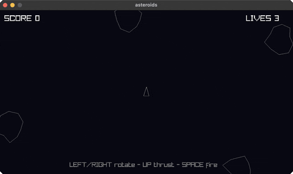

### tetris

the block-stacking puzzle (move/rotate/drop)

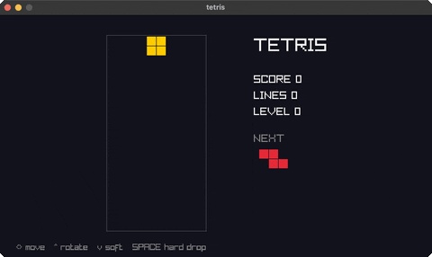

### pong

two-paddle classic, you (W/S) vs a CPU



### vampire-survivors

auto-fire survival: move, waves chase you

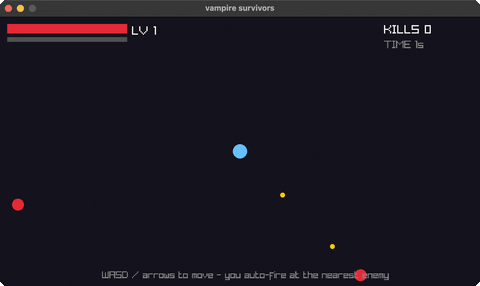

### snake

the classic snake (arrow keys, grow, don't crash)

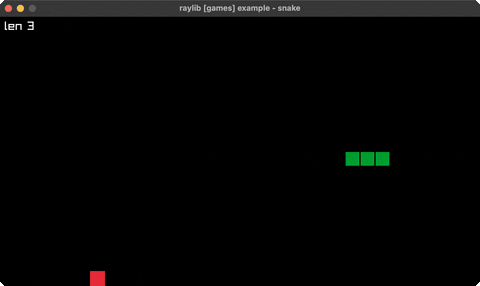

### breakout

paddle + ball + brick grid (mouse paddle)

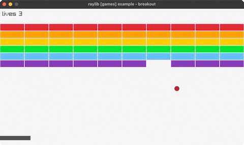

### space-invaders

marching aliens (arrows + SPACE to shoot)

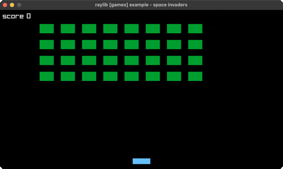

### flappy-bird

flap through the pipe gaps (SPACE)

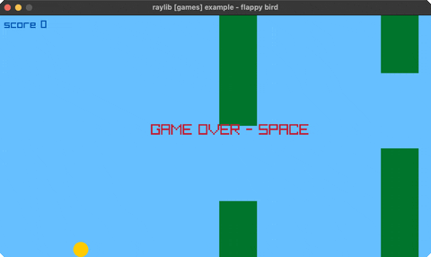

### game-2048

2048: 4x4 tile-merge puzzle (arrow keys)

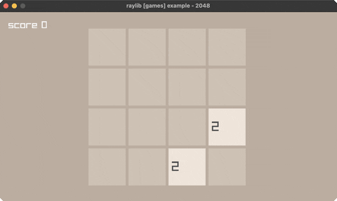

### minesweeper

reveal/flag grid (mouse L reveal, R flag)

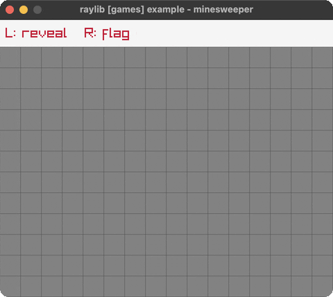

## core

### basic-window

the minimal raylib window + text

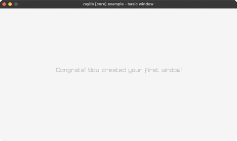

### input-keys

steer a ball with the arrow keys

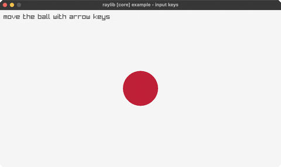

### input-mouse

a ball follows the mouse; click to recolor

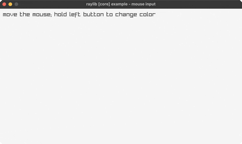

### input-mouse-wheel

scroll a box with the mouse wheel

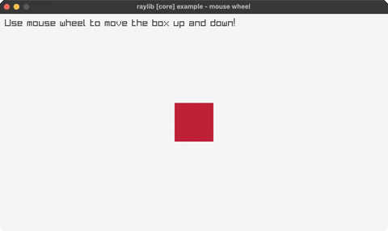

### camera-2d

a 2D camera over a skyline (struct-by-value)

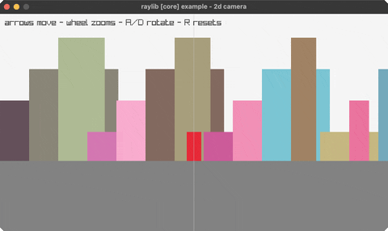

### delta-time

per-frame vs delta-time movement

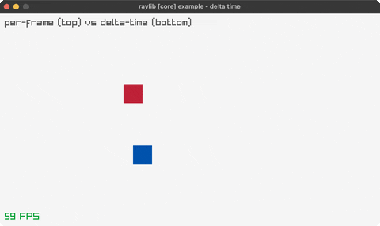

### scissor-test

a scissor rectangle clips a grid

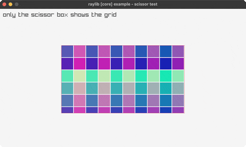

### basic-screen-manager

a LOGO/TITLE/GAMEPLAY/ENDING flow

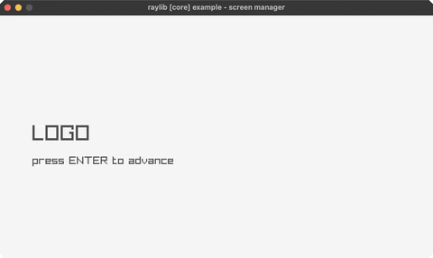

### random-values

a new random value every two seconds

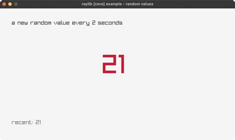

## shapes

### bouncing-ball

a ball bouncing around the window

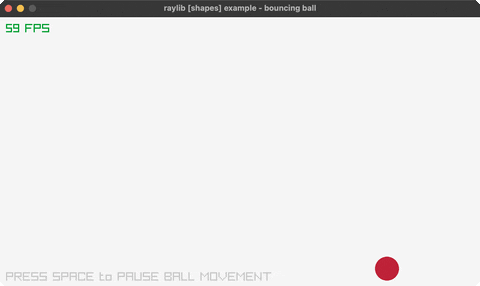

### basic-shapes

shape primitives + an rlgl triangle

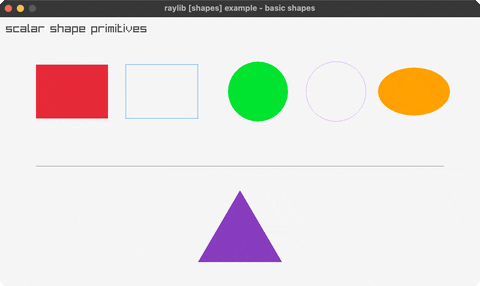

### colors-palette

every named raylib color in a grid

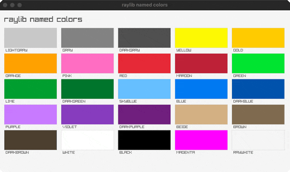

### gradient

a vertical two-color gradient

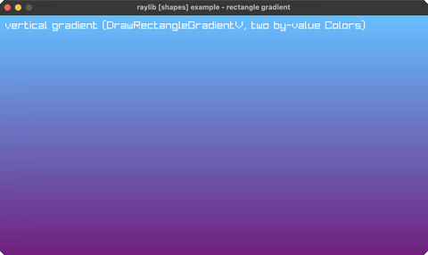

### following-eyes

two eyes track the mouse

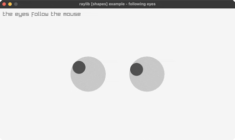

### starfield

a twinkling starfield

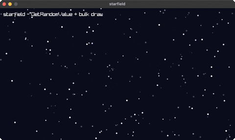

### logo-raylib

the raylib logo from rectangles + text

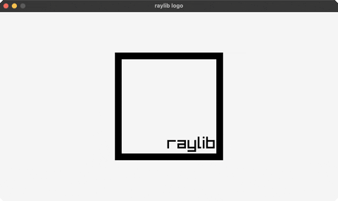

### mouse-trail

a fading trail follows the cursor

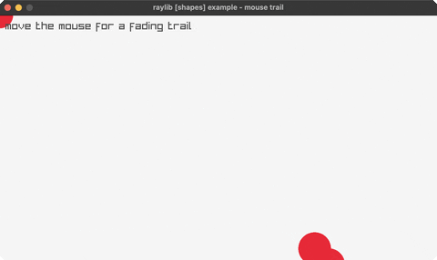

### recursive-tree

a binary fractal tree

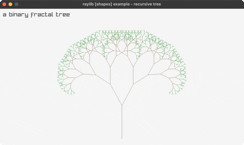

### math-sine-cosine

a live unit-circle trig visualization

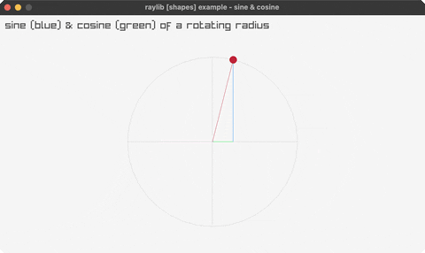

### bullet-hell

a rotating bullet spiral

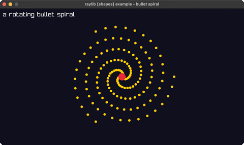

### triangle-strip

a rainbow strip via rlgl immediate mode

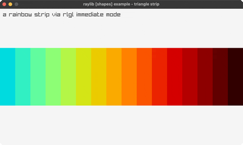

### collision-area

AABB collision between two boxes

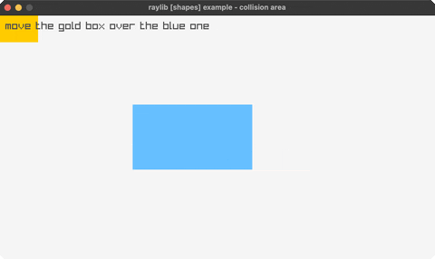

### dashed-line

a dashed line follows the mouse

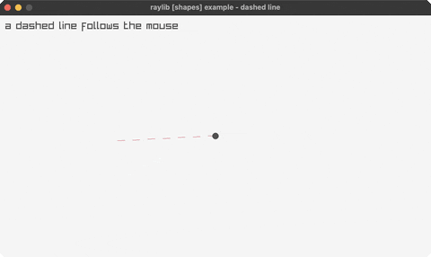

### double-pendulum

chaotic double-pendulum motion + trail

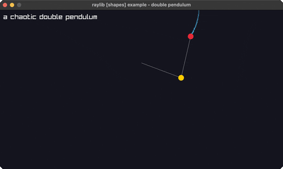

### kaleidoscope

strokes mirrored with 6-fold symmetry

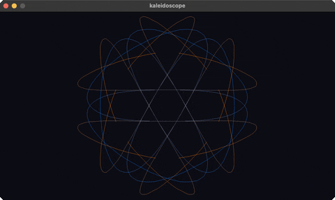

### hilbert-curve

a rainbow Hilbert space-filling curve

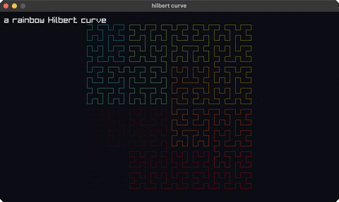

### math-angle-rotation

fixed spokes + a spinning line

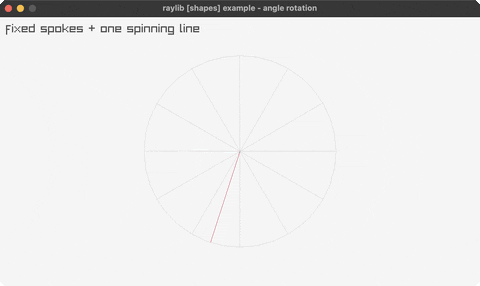

### ball-physics

2D balls under gravity, SPACE respawns

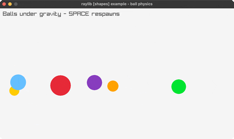

### lines-bezier

a cubic Bézier that follows the mouse

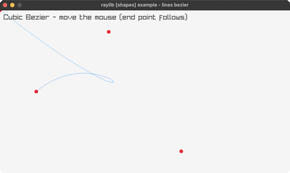

### color-wheel

an HSV color wheel (rlgl triangle fan)

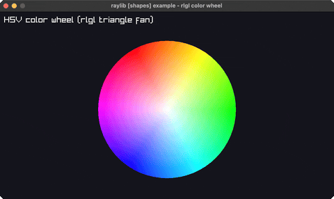

### pie-chart

labelled pie slices via rl/sector!

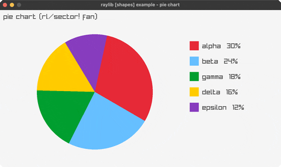

### splines

Catmull-Rom / Bezier / B-spline (SPACE cycles)

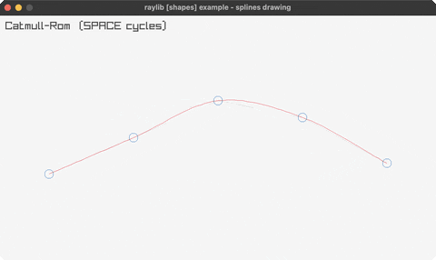

### vector-angle

the angle between two vectors (arc + readout)

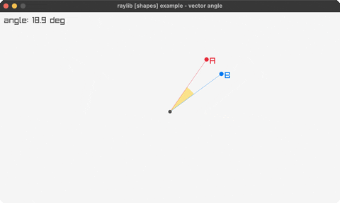

### easings

a grid of balls, each on a different easing curve

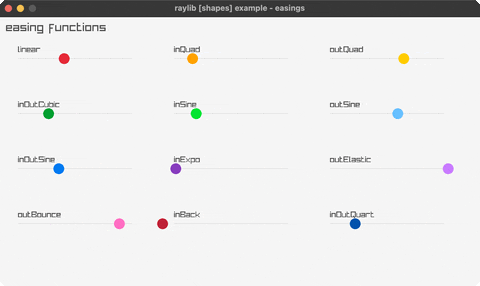

### penrose-tiling

a P3 Penrose rhombus tiling (deflation)

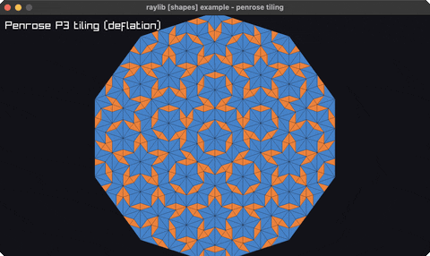

### analog-clock

a live analog clock (libc local time)

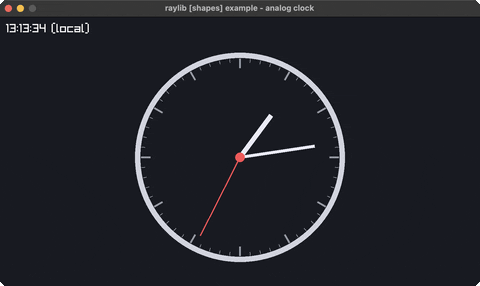

### digital-clock

a seven-segment HH:MM:SS clock (libc time)

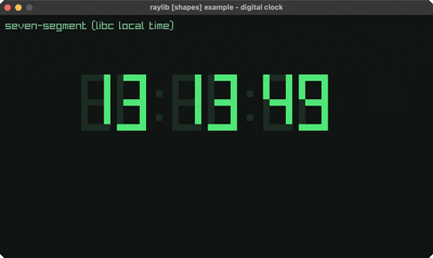

### ring-drawing

an animated annulus via rl/ring!

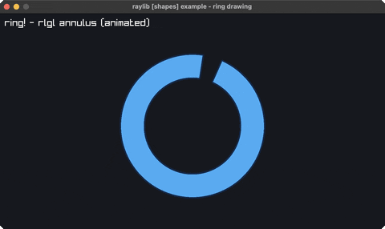

### rounded-rectangle

rounded rects via sector! corners

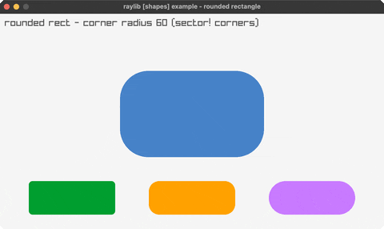

### rectangle-scaling

drag the corner handle to resize a rect

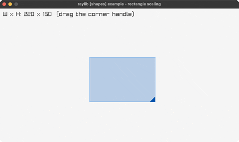

### lines-drawing

a rotating fan of thick lines (line-ex!)

## text

### font-sizes

font sizes + MeasureText centering

### writing-anim

a message types itself out

### format-text

padded score + MM:SS timer readouts

### words-alignment

align a word inside a box (MeasureText)

### input-box

type into a text box (GetCharPressed)

## 3d

### camera-3d

an orbiting 3D camera (Camera3D by value)

### waving-cubes

an NxN grid of cubes rippling in 3D

### camera-3d-first-person

walk a yard of columns in first person

### tesseract-view

a rotating 4D hypercube projected to 2D

### wireframe-shapes

pyramid/octahedron/torus/helix in 3D lines

### rlgl-solar-system

Sun/Earth/Moon via the rlgl matrix stack

### box-collisions

a player cube colliding with 3D boxes

### rotating-cube

a single cube spinning via the rlgl matrix stack

### spinning-cubes

a row of cubes each spinning with a phase offset

### orthographic-projection

perspective vs orthographic (SPACE toggles)

### point-cloud

~1500 points as tiny rlgl cubes, rotating

### bouncing-spheres

spheres bouncing in a 3D box (rl/sphere!)

## generative

### game-of-life

Conway's Game of Life (SPACE reseeds)

### boids

flocking birds (separation/alignment/cohesion)

### fireworks

rockets + fading particle bursts

### fourier-epicycles

rotating circles trace a square wave

### spirograph

animated hypotrochoid roulette curves

### l-system

an L-system fractal plant (grows + regrows)

### flow-field

particles steered by a flow field (trails)

