# Full-size demo gallery

Every example at full size, linked from [the example catalog](example-catalog.md)'s preview thumbnails.

## games (10)

### asteroids

the classic vector shooter (rotate/thrust/fire)

### tetris

the block-stacking puzzle (move/rotate/drop)

### pong

two-paddle classic, you (W/S) vs a CPU

### vampire-survivors

auto-fire survival: move, waves chase you

### snake

the classic snake (arrow keys, grow, don't crash)

### breakout

paddle + ball + brick grid (mouse paddle)

### space-invaders

marching aliens (arrows + SPACE to shoot)

### flappy-bird

flap through the pipe gaps (SPACE)

### game-2048

2048: 4x4 tile-merge puzzle (arrow keys)

### minesweeper

reveal/flag grid (mouse L reveal, R flag)

## core (16)

### basic-window

the minimal raylib window + text

### input-keys

steer a ball with the arrow keys

### input-mouse

a ball follows the mouse; click to recolor

### input-mouse-wheel

scroll a box with the mouse wheel

### camera-2d

a 2D camera over a skyline (struct-by-value)

### delta-time

per-frame vs delta-time movement

### scissor-test

a scissor rectangle clips a grid

### basic-screen-manager

a LOGO/TITLE/GAMEPLAY/ENDING flow

### random-values

a new random value every two seconds

### window-letterbox

a fixed 640x360 picture letterboxed into a resizable window

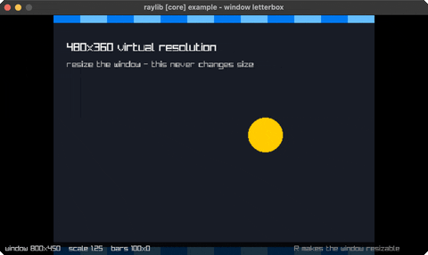

### window-flags

toggle vsync, resizable, undecorated and topmost live

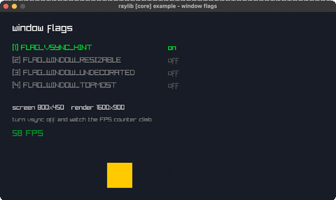

### monitor-detector

every attached display, with the current one highlighted

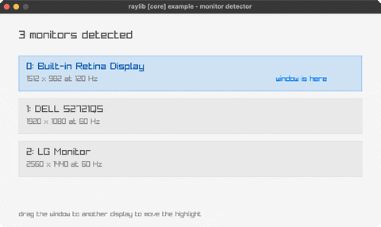

### clipboard-text

type, C copies to the system clipboard, V pastes

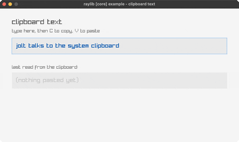

### input-gamepad

live sticks, triggers and buttons for gamepad 0

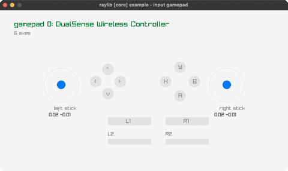

### input-multitouch

active touch points (the mouse is point 0 on desktop)

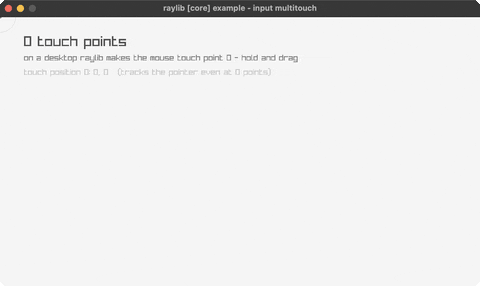

### input-virtual-controls

an on-screen D-pad and action button

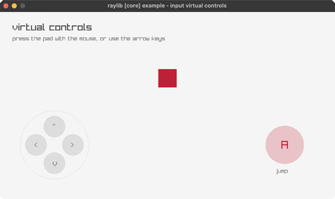

## shapes (32)

### bouncing-ball

a ball bouncing around the window

### basic-shapes

shape primitives + an rlgl triangle

### colors-palette

every named raylib color in a grid

### gradient

a vertical two-color gradient

### following-eyes

two eyes track the mouse

### starfield

a twinkling starfield

### logo-raylib

the raylib logo from rectangles + text

### mouse-trail

a fading trail follows the cursor

### recursive-tree

a binary fractal tree

### math-sine-cosine

a live unit-circle trig visualization

### bullet-hell

a rotating bullet spiral

### triangle-strip

a rainbow strip via rlgl immediate mode

### collision-area

AABB collision between two boxes

### dashed-line

a dashed line follows the mouse

### double-pendulum

chaotic double-pendulum motion + trail

### kaleidoscope

strokes mirrored with 6-fold symmetry

### hilbert-curve

a rainbow Hilbert space-filling curve

### math-angle-rotation

fixed spokes + a spinning line

### ball-physics

2D balls under gravity, SPACE respawns

### lines-bezier

a cubic Bézier that follows the mouse

### color-wheel

an HSV color wheel (rlgl triangle fan)

### pie-chart

labelled pie slices via rl/sector!

### splines

Catmull-Rom / Bezier / B-spline (SPACE cycles)

### vector-angle

the angle between two vectors (arc + readout)

### easings

a grid of balls, each on a different easing curve

### penrose-tiling

a P3 Penrose rhombus tiling (deflation)

### analog-clock

a live analog clock (libc local time)

### digital-clock

a seven-segment HH:MM:SS clock (libc time)

### ring-drawing

an animated annulus via rl/ring!

### rounded-rectangle

rounded rects via sector! corners

### rectangle-scaling

drag the corner handle to resize a rect

### lines-drawing

a rotating fan of thick lines (line-ex!)

## text (5)

### font-sizes

font sizes + MeasureText centering

### writing-anim

a message types itself out

### format-text

padded score + MM:SS timer readouts

### words-alignment

align a word inside a box (MeasureText)

### input-box

type into a text box (GetCharPressed)

## 3d (16)

### camera-3d

an orbiting 3D camera (Camera3D by value)

### waving-cubes

an NxN grid of cubes rippling in 3D

### camera-3d-first-person

walk a yard of columns in first person

### tesseract-view

a rotating 4D hypercube projected to 2D

### wireframe-shapes

pyramid/octahedron/torus/helix in 3D lines

### rlgl-solar-system

Sun/Earth/Moon via the rlgl matrix stack

### box-collisions

a player cube colliding with 3D boxes

### rotating-cube

a single cube spinning via the rlgl matrix stack

### spinning-cubes

a row of cubes each spinning with a phase offset

### orthographic-projection

perspective vs orthographic (SPACE toggles)

### point-cloud

~1500 points as tiny rlgl cubes, rotating

### bouncing-spheres

spheres bouncing in a 3D box (rl/sphere!)

### lorenz-attractor

the Lorenz strange attractor traced in 3D (UP/DOWN rho)

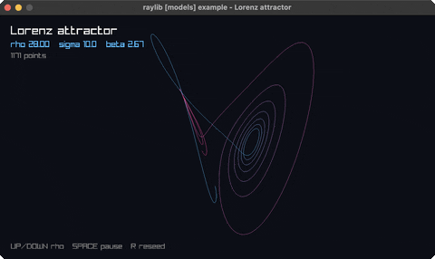

### dna-helix

a turning double helix with coloured base pairs

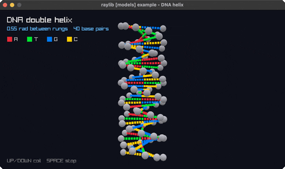

### yaw-pitch-roll

the three aircraft rotations on the rlgl matrix stack

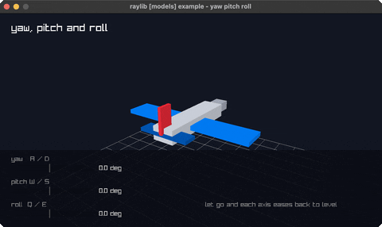

### first-person-maze

walk a grid maze in first person, with a minimap

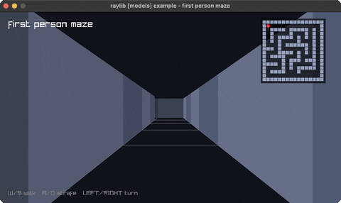

## generative (8)

### game-of-life

Conway's Game of Life (SPACE reseeds)

### boids

flocking birds (separation/alignment/cohesion)

### fireworks

rockets + fading particle bursts

### fourier-epicycles

rotating circles trace a square wave

### spirograph

animated hypotrochoid roulette curves

### l-system

an L-system fractal plant (grows + regrows)

### flow-field

particles steered by a flow field (trails)

### cellular-automata

Wolfram's elementary automata (LEFT/RIGHT change rule)

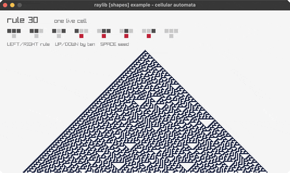

## textures (4)

### texture-procedural

four textures generated pixel by pixel (SPACE reseeds noise)

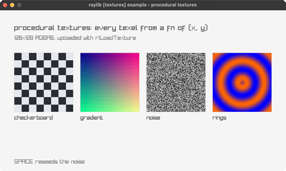

### texture-tiling

one small tile repeated across the window (UP/DOWN density)

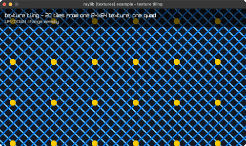

### render-texture

a scene rendered off-screen, then drawn back four times

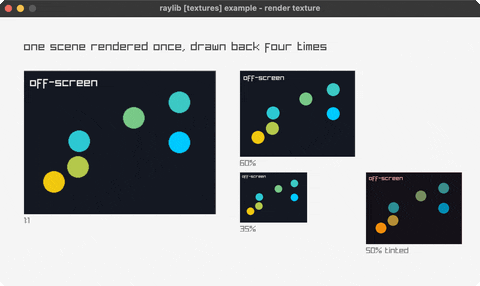

### bunnymark

the sprite-count benchmark (hold the mouse to add bunnies)

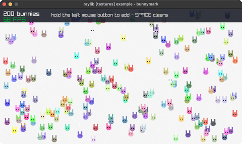
