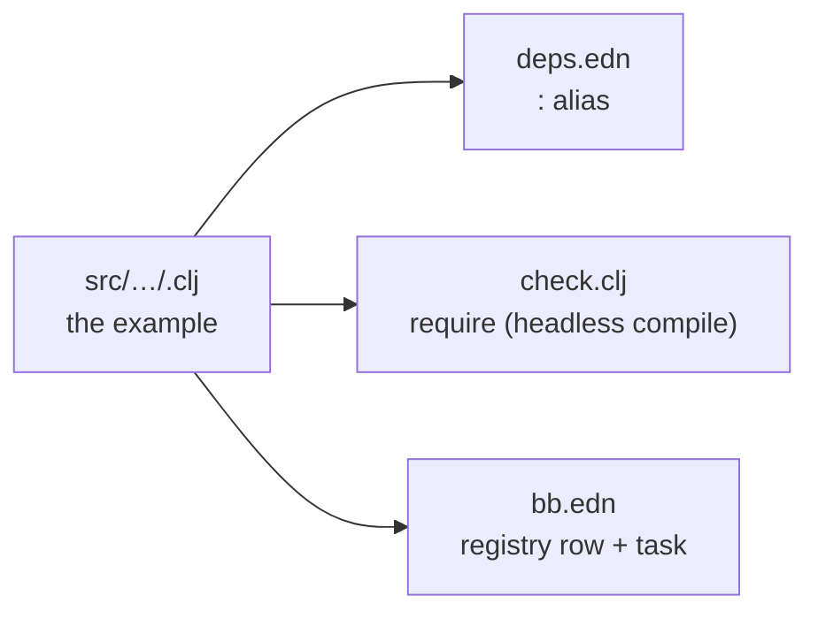

# The example catalog — 69 raylib demos in jolt

A map of the whole suite. Each example is one namespace under
`src/net/b12n/rljlt/`, runnable by a friendly `bb <name>` task or the underlying
`joltc -M:<alias>`. `bb info` prints this grouping live; this page adds the "how it's
wired" recipe at the end.

Run one, list them, or reel through all of them:

```sh
bb <name>          # e.g. bb asteroids   (opens a window)
bb examples        # flat list with descriptions
bb info            # the grouped cheat-sheet below
bb run-all [secs]  # every example, N seconds each (unattended)
```

## games (10)

| `bb` name | shows |
|---|---|
| `asteroids` | the classic vector shooter — rotate / thrust / fire, splitting asteroids |
| `tetris` | 10×20 well, 7 tetrominoes, rotation, line-clearing, levels |
| `pong` | two-paddle classic, you (W/S) vs a ball-tracking CPU |
| `vampire-survivors` | auto-firing survivors-like — chasing waves, XP gems, leveling |
| `snake` | the classic snake (arrow keys, grow, don't crash) |
| `breakout` | paddle + ball + brick grid (mouse paddle) |
| `space-invaders` | marching aliens (arrows + SPACE to shoot) |
| `flappy-bird` | flap through the pipe gaps (SPACE) |
| `game-2048` | 2048: 4x4 tile-merge puzzle (arrow keys) |
| `minesweeper` | reveal/flag grid (mouse L reveal, R flag) |

## core (9)

| `bb` name | shows |
|---|---|
| `basic-window` | the minimal window + text (the default, `joltc -M:run`) |
| `input-keys` | `IsKeyDown`, steer a ball with the arrow keys |
| `input-mouse` | `GetMouseX/Y`, `IsMouseButtonDown`, click to recolor |
| `input-mouse-wheel` | `GetMouseWheelMove` (a float return) scrolls a box |
| `camera-2d` | a 2D camera over a skyline — struct-by-value (see below) |
| `delta-time` | per-frame vs `GetFrameTime` movement |
| `scissor-test` | `BeginScissorMode` clips a grid |
| `basic-screen-manager` | a LOGO / TITLE / GAMEPLAY / ENDING state flow |
| `random-values` | `GetRandomValue`, a new value every 2s |

## shapes (26)

| `bb` name | shows |
|---|---|
| `bouncing-ball` | animation, `IsKeyPressed` pause, `DrawFPS` |
| `basic-shapes` | rect / circle / ellipse / line + an rlgl triangle |
| `colors-palette` | every named raylib color in a grid |
| `gradient` | `DrawRectangleGradientV` (two by-value Colors) |
| `following-eyes` | pupils track the mouse (scalar trig) |
| `starfield` | `GetRandomValue` + bulk draw, per-star twinkle |
| `logo-raylib` | rectangles + text, positioned with `MeasureText` |
| `mouse-trail` | a fading cursor trail (alpha) |
| `recursive-tree` | a binary fractal tree (lines + trig) |
| `math-sine-cosine` | a live unit-circle sine/cosine visualization |
| `bullet-hell` | a rotating bullet spiral |
| `triangle-strip` | a rainbow strip via rlgl immediate mode |
| `collision-area` | AABB collision between two boxes (computed in Clojure) |
| `dashed-line` | a dashed line follows the mouse |
| `double-pendulum` | chaotic double-pendulum motion + trail |
| `kaleidoscope` | strokes mirrored with 6-fold symmetry |
| `hilbert-curve` | a rainbow Hilbert space-filling curve |
| `math-angle-rotation` | fixed spokes + a spinning line |
| `ball-physics` | 2D balls under gravity, SPACE respawns |
| `lines-bezier` | a cubic Bézier that follows the mouse |
| `color-wheel` | an HSV color wheel drawn as an rlgl triangle fan (per-vertex hue) |
| `pie-chart` | labelled pie slices via `rl/sector!` + a legend |
| `splines` | Catmull-Rom / cubic-Bézier / uniform-B-spline through animated points (SPACE cycles) |
| `vector-angle` | the signed angle between two vectors, filled arc + degrees readout (`atan2`) |
| `easings` | a 3×4 grid of balls, each animating on a different easing curve |
| `penrose-tiling` | a P3 Penrose rhombus tiling built by golden-ratio deflation |

## text (5)

| `bb` name | shows |
|---|---|
| `font-sizes` | font sizes + `MeasureText` centering |
| `writing-anim` | a self-typing message |
| `format-text` | `format` padded score + MM:SS timer |
| `words-alignment` | align a word inside a box with `MeasureText` |
| `input-box` | type into a text box (GetCharPressed) |

## 3d (12)

| `bb` name | shows |
|---|---|
| `camera-3d` | an orbiting 3D camera — `Camera3D` by value + rlgl cube |
| `waving-cubes` | 196 cubes rippling in 3D (shared `rl/cube!`) |
| `camera-3d-first-person` | WASD + mouse-look walk through columns |
| `tesseract-view` | a rotating 4D hypercube projected 4D→3D→2D |
| `wireframe-shapes` | pyramid / octahedron / torus / helix as rlgl 3D lines |
| `rlgl-solar-system` | Sun / Earth / Moon via the rlgl matrix stack |
| `box-collisions` | a player cube vs. boxes, 3D AABB highlight |
| `rotating-cube` | a single cube spinning via the rlgl matrix stack |
| `spinning-cubes` | a row of cubes each spinning with a phase offset |
| `orthographic-projection` | perspective vs orthographic (SPACE toggles) |
| `point-cloud` | ~1500 points as tiny rlgl cubes, rotating |
| `bouncing-spheres` | spheres bouncing in a 3D box (rl/sphere!) |

The 3D set stands entirely on two building blocks from
[`rlgl-immediate-mode.md`](rlgl-immediate-mode.md) and
[`struct-by-value-pointer-trick.md`](struct-by-value-pointer-trick.md): `with-camera-3d`
(the camera, by pointer) and `cube!` (the geometry, by rlgl vertices).

## generative (7)

| `bb` name | shows |
|---|---|
| `game-of-life` | Conway's Game of Life (SPACE reseeds) |
| `boids` | flocking birds (separation/alignment/cohesion) |
| `fireworks` | rockets + fading particle bursts |
| `fourier-epicycles` | rotating circles trace a square wave |
| `spirograph` | animated hypotrochoid roulette curves |
| `l-system` | an L-system fractal plant (grows + regrows) |
| `flow-field` | particles steered by a flow field (trails) |

All seven are pure math + the drawing API — no new bindings. They showcase the
suite as a generative-art canvas: cellular automata, agent flocking, particle
systems, rotating-vector Fourier series, parametric roulette curves, string-rewrite
fractals, and noise-steered flow fields.

## Adding an example — the four touchpoints

The suite is deliberately mechanical to grow. One new example touches four places:

1. **Source** — `src/net/b12n/rljlt/<name>.clj`, a namespace with a `-main` that
   runs the canonical loop (see [`headless-smoke-testing.md`](headless-smoke-testing.md))
   against the `net.b12n.rljlt.raylib` API.
2. **`deps.edn` alias** — `:<name> {:main-opts ["-m" "net.b12n.rljlt.<name>"]}` so
   `joltc -M:<name>` works.
3. **`check.clj` require** — add `net.b12n.rljlt.<name>` to the `:require` list in
   `net.b12n.rljlt.check`, so the headless compile-check covers it.
4. **`bb.edn` registry row** — add `["<display-name>" "<alias>" "<group>" "<desc>"]`
   to the `examples` vector and a matching `bb <name>` task, so it shows in
   `bb info` / `bb examples` / `bb run-all`.



Filenames use underscores (`basic_screen_manager.clj`); the namespace uses hyphens
(`net.b12n.rljlt.basic-screen-manager`) — Clojure's standard file↔ns mapping.

## See also

- [`kwarg-drawing-api.md`](kwarg-drawing-api.md) — the API every example is written
  against.
- [`headless-smoke-testing.md`](headless-smoke-testing.md) — the loop shape and how
  `bb run-all` / `bb check` verify the catalog.
