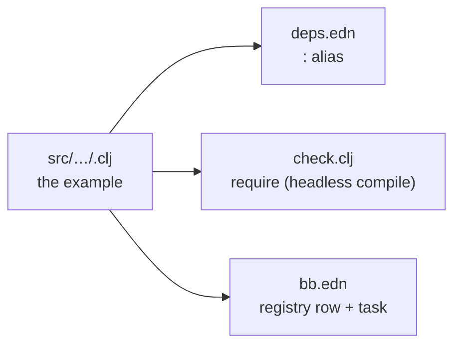

# The example catalog — 75 raylib demos in jolt

A map of the whole suite. Each example is one namespace under
`src/net/b12n/raylib_jlt/`, runnable by a friendly `bb <name>` task or the underlying
`jolt -M:<alias>`. `bb info` prints this grouping live; this page adds the "how it's
wired" recipe at the end.

Run one, list them, or reel through all of them:

```sh
bb <name>          # e.g. bb asteroids   (opens a window)
bb examples        # flat list with descriptions
bb info            # the grouped cheat-sheet below
bb run-all [secs]  # every example, N seconds each (unattended)
```

## games (10)

| preview | `bb` name | shows |
|---|---|---|
| [](demos.md#asteroids) | `asteroids` | the classic vector shooter — rotate / thrust / fire, splitting asteroids |
| [](demos.md#tetris) | `tetris` | 10×20 well, 7 tetrominoes, rotation, line-clearing, levels |
| [](demos.md#pong) | `pong` | two-paddle classic, you (W/S) vs a ball-tracking CPU |
| [](demos.md#vampire-survivors) | `vampire-survivors` | auto-firing survivors-like — chasing waves, XP gems, leveling |
| [](demos.md#snake) | `snake` | the classic snake (arrow keys, grow, don't crash) |
| [](demos.md#breakout) | `breakout` | paddle + ball + brick grid (mouse paddle) |
| [](demos.md#space-invaders) | `space-invaders` | marching aliens (arrows + SPACE to shoot) |
| [](demos.md#flappy-bird) | `flappy-bird` | flap through the pipe gaps (SPACE) |
| [](demos.md#game-2048) | `game-2048` | 2048: 4x4 tile-merge puzzle (arrow keys) |
| [](demos.md#minesweeper) | `minesweeper` | reveal/flag grid (mouse L reveal, R flag) |

## core (9)

| preview | `bb` name | shows |
|---|---|---|
| [](demos.md#basic-window) | `basic-window` | the minimal window + text (the default, `jolt -M:run`) |
| [](demos.md#input-keys) | `input-keys` | `IsKeyDown`, steer a ball with the arrow keys |
| [](demos.md#input-mouse) | `input-mouse` | `GetMouseX/Y`, `IsMouseButtonDown`, click to recolor |
| [](demos.md#input-mouse-wheel) | `input-mouse-wheel` | `GetMouseWheelMove` (a float return) scrolls a box |
| [](demos.md#camera-2d) | `camera-2d` | a 2D camera over a skyline — struct-by-value (see below) |
| [](demos.md#delta-time) | `delta-time` | per-frame vs `GetFrameTime` movement |
| [](demos.md#scissor-test) | `scissor-test` | `BeginScissorMode` clips a grid |
| [](demos.md#basic-screen-manager) | `basic-screen-manager` | a LOGO / TITLE / GAMEPLAY / ENDING state flow |
| [](demos.md#random-values) | `random-values` | `GetRandomValue`, a new value every 2s |

## shapes (32)

| preview | `bb` name | shows |
|---|---|---|
| [](demos.md#bouncing-ball) | `bouncing-ball` | animation, `IsKeyPressed` pause, `DrawFPS` |
| [](demos.md#basic-shapes) | `basic-shapes` | rect / circle / ellipse / line + an rlgl triangle |
| [](demos.md#colors-palette) | `colors-palette` | every named raylib color in a grid |
| [](demos.md#gradient) | `gradient` | `DrawRectangleGradientV` (two by-value Colors) |
| [](demos.md#following-eyes) | `following-eyes` | pupils track the mouse (scalar trig) |
| [](demos.md#starfield) | `starfield` | `GetRandomValue` + bulk draw, per-star twinkle |
| [](demos.md#logo-raylib) | `logo-raylib` | rectangles + text, positioned with `MeasureText` |
| [](demos.md#mouse-trail) | `mouse-trail` | a fading cursor trail (alpha) |
| [](demos.md#recursive-tree) | `recursive-tree` | a binary fractal tree (lines + trig) |
| [](demos.md#math-sine-cosine) | `math-sine-cosine` | a live unit-circle sine/cosine visualization |
| [](demos.md#bullet-hell) | `bullet-hell` | a rotating bullet spiral |
| [](demos.md#triangle-strip) | `triangle-strip` | a rainbow strip via rlgl immediate mode |
| [](demos.md#collision-area) | `collision-area` | AABB collision between two boxes (computed in Clojure) |
| [](demos.md#dashed-line) | `dashed-line` | a dashed line follows the mouse |
| [](demos.md#double-pendulum) | `double-pendulum` | chaotic double-pendulum motion + trail |
| [](demos.md#kaleidoscope) | `kaleidoscope` | strokes mirrored with 6-fold symmetry |
| [](demos.md#hilbert-curve) | `hilbert-curve` | a rainbow Hilbert space-filling curve |
| [](demos.md#math-angle-rotation) | `math-angle-rotation` | fixed spokes + a spinning line |
| [](demos.md#ball-physics) | `ball-physics` | 2D balls under gravity, SPACE respawns |
| [](demos.md#lines-bezier) | `lines-bezier` | a cubic Bézier that follows the mouse |
| [](demos.md#color-wheel) | `color-wheel` | an HSV color wheel drawn as an rlgl triangle fan (per-vertex hue) |
| [](demos.md#pie-chart) | `pie-chart` | labelled pie slices via `rl/sector!` + a legend |
| [](demos.md#splines) | `splines` | Catmull-Rom / cubic-Bézier / uniform-B-spline through animated points (SPACE cycles) |
| [](demos.md#vector-angle) | `vector-angle` | the signed angle between two vectors, filled arc + degrees readout (`atan2`) |
| [](demos.md#easings) | `easings` | a 3×4 grid of balls, each animating on a different easing curve |
| [](demos.md#penrose-tiling) | `penrose-tiling` | a P3 Penrose rhombus tiling built by golden-ratio deflation |
| [](demos.md#analog-clock) | `analog-clock` | a live analog clock (bezel `ring!`, ticks + hands `line-ex!`, libc local time) |
| [](demos.md#digital-clock) | `digital-clock` | a seven-segment `HH:MM:SS` display (libc local time) |
| [](demos.md#ring-drawing) | `ring-drawing` | an animated annulus via `rl/ring!` + a stroked outline |
| [](demos.md#rounded-rectangle) | `rounded-rectangle` | rounded rectangles built from `sector!` corners + rects |
| [](demos.md#rectangle-scaling) | `rectangle-scaling` | drag the bottom-right corner handle to resize a rectangle |
| [](demos.md#lines-drawing) | `lines-drawing` | a rotating fan of thick lines via `rl/line-ex!` (rlgl quads) |

## text (5)

| preview | `bb` name | shows |
|---|---|---|
| [](demos.md#font-sizes) | `font-sizes` | font sizes + `MeasureText` centering |
| [](demos.md#writing-anim) | `writing-anim` | a self-typing message |
| [](demos.md#format-text) | `format-text` | `format` padded score + MM:SS timer |
| [](demos.md#words-alignment) | `words-alignment` | align a word inside a box with `MeasureText` |
| [](demos.md#input-box) | `input-box` | type into a text box (GetCharPressed) |

## 3d (12)

| preview | `bb` name | shows |
|---|---|---|
| [](demos.md#camera-3d) | `camera-3d` | an orbiting 3D camera — `Camera3D` by value + rlgl cube |
| [](demos.md#waving-cubes) | `waving-cubes` | 196 cubes rippling in 3D (shared `rl/cube!`) |
| [](demos.md#camera-3d-first-person) | `camera-3d-first-person` | WASD + mouse-look walk through columns |
| [](demos.md#tesseract-view) | `tesseract-view` | a rotating 4D hypercube projected 4D→3D→2D |
| [](demos.md#wireframe-shapes) | `wireframe-shapes` | pyramid / octahedron / torus / helix as rlgl 3D lines |
| [](demos.md#rlgl-solar-system) | `rlgl-solar-system` | Sun / Earth / Moon via the rlgl matrix stack |
| [](demos.md#box-collisions) | `box-collisions` | a player cube vs. boxes, 3D AABB highlight |
| [](demos.md#rotating-cube) | `rotating-cube` | a single cube spinning via the rlgl matrix stack |
| [](demos.md#spinning-cubes) | `spinning-cubes` | a row of cubes each spinning with a phase offset |
| [](demos.md#orthographic-projection) | `orthographic-projection` | perspective vs orthographic (SPACE toggles) |
| [](demos.md#point-cloud) | `point-cloud` | ~1500 points as tiny rlgl cubes, rotating |
| [](demos.md#bouncing-spheres) | `bouncing-spheres` | spheres bouncing in a 3D box (rl/sphere!) |

The 3D set stands entirely on two building blocks from
[`rlgl-immediate-mode.md`](rlgl-immediate-mode.md) and
[`struct-by-value-pointer-trick.md`](struct-by-value-pointer-trick.md): `with-camera-3d`
(the camera, by pointer) and `cube!` (the geometry, by rlgl vertices).

## generative (7)

| preview | `bb` name | shows |
|---|---|---|
| [](demos.md#game-of-life) | `game-of-life` | Conway's Game of Life (SPACE reseeds) |
| [](demos.md#boids) | `boids` | flocking birds (separation/alignment/cohesion) |
| [](demos.md#fireworks) | `fireworks` | rockets + fading particle bursts |
| [](demos.md#fourier-epicycles) | `fourier-epicycles` | rotating circles trace a square wave |
| [](demos.md#spirograph) | `spirograph` | animated hypotrochoid roulette curves |
| [](demos.md#l-system) | `l-system` | an L-system fractal plant (grows + regrows) |
| [](demos.md#flow-field) | `flow-field` | particles steered by a flow field (trails) |

All seven are pure math + the drawing API — no new bindings. They showcase the
suite as a generative-art canvas: cellular automata, agent flocking, particle
systems, rotating-vector Fourier series, parametric roulette curves, string-rewrite
fractals, and noise-steered flow fields.

## Adding an example — the four touchpoints

The suite is deliberately mechanical to grow. One new example touches four places:

1. **Source** — `src/net/b12n/raylib_jlt/<name>.clj`, a namespace with a `-main` that
   runs the canonical loop (see [`headless-smoke-testing.md`](headless-smoke-testing.md))
   against the `net.b12n.raylib-jlt.raylib` API.
2. **`deps.edn` alias** — `:<name> {:main-opts ["-m" "net.b12n.raylib-jlt.<name>"]}` so
   `jolt -M:<name>` works.
3. **`check.clj` require** — add `net.b12n.raylib-jlt.<name>` to the `:require` list in
   `net.b12n.raylib-jlt.check`, so the headless compile-check covers it.
4. **`bb.edn` registry row** — add `["<display-name>" "<alias>" "<group>" "<desc>"]`
   to the `examples` vector and a matching `bb <name>` task, so it shows in
   `bb info` / `bb examples` / `bb run-all`.



Filenames use underscores (`basic_screen_manager.clj`); the namespace uses hyphens
(`net.b12n.raylib-jlt.basic-screen-manager`) — Clojure's standard file↔ns mapping.

One ordering rule applies inside every file: since **jolt 0.4.0** an unresolved
symbol is a compile error rather than a late-bound reference, so a definition must
appear before its first use — in a fn body and in an `:or` destructuring default
just as much as at top level. It bites hardest in the shared `raylib.clj` binding
layer, where one misordered symbol stops *every* example from loading and only the
first offender is reported. `jolt -M:check` is the quick confirmation; see the
[jolt note in the README](../../README.md#requirements).

## See also

- [`kwarg-drawing-api.md`](kwarg-drawing-api.md) — the API every example is written
  against.
- [`headless-smoke-testing.md`](headless-smoke-testing.md) — the loop shape and how
  `bb run-all` / `bb check` verify the catalog.
